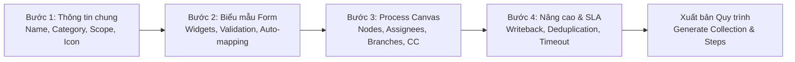
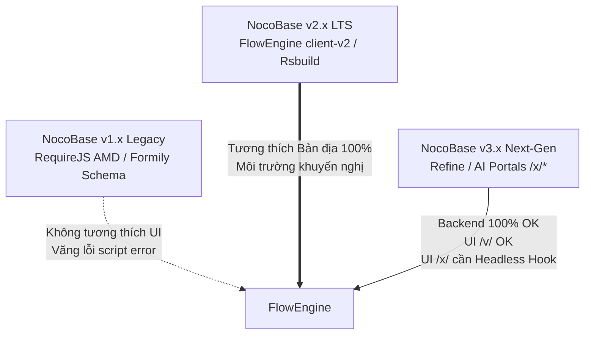

# Cẩm Nang Toàn Diện Thiết Kế Luồng Phê Duyệt Doanh Nghiệp (`@basancorp/plugin-approval-flow`)

Plugin `@basancorp/plugin-approval-flow` (Enterprise Certified v1.1.0 / v2.1.0 Skill) là bộ máy quy trình phê duyệt doanh nghiệp (Enterprise Multi-level Approval Engine) được thiết kế chuyên sâu cho nền tảng NocoBase v2 (`client-v2` và `@nocobase/plugin-mobile`) và tương thích backend NocoBase v3.

Khác với workflow automation thuần túy của hệ thống, Approval Flow tập trung giải quyết bài toán cốt lõi: **Con người ra quyết định thẩm định (Human-in-the-loop)** với đầy đủ thẩm quyền tổ chức ma trận, phân nhánh điều kiện linh hoạt, chữ ký tay điện tử, bàn giao vị trí và tích hợp chặt chẽ với CSDL nghiệp vụ (Data Writeback & Physical State Machine).

---

## 1. Bản Đồ Phân Hệ & Điều Hướng (Navigation Map)

Người quản trị và người dùng thao tác thông qua các đường dẫn chuẩn SPA (tiền tố `/v/`):

| Phân hệ | Đường dẫn (URL) | Chức năng chính |
|---|---|---|
| **Trung tâm phê duyệt** | `/v/approval-center` | Giao diện người dùng: Việc cần tôi duyệt, Việc tôi đã duyệt, Đơn tôi đã tạo, Đơn CC |
| **Quản lý quy trình** | `/v/approval-flows` | Danh mục quy trình mẫu, trạng thái xuất bản, khởi tạo quy trình mới |
| **Studio thiết kế** | `/v/approval-studio/:id?` | Studio 4 bước: Thông tin chung $\rightarrow$ Form $\rightarrow$ Canvas luồng $\rightarrow$ Cài đặt nâng cao |
| **Quản lý dữ liệu** | `/v/approval-data` | Toàn bộ hồ sơ doanh nghiệp, quyền thu hồi, hủy đơn, duyệt khẩn cấp, xuất Excel |
| **Phân tích & Hiệu suất** | `/v/approval-analytics` | Báo cáo SLA, tỷ lệ duyệt, phát hiện điểm nghẽn (bottleneck) theo bước/phòng ban |
| **Ủy quyền & Bàn giao** | `/v/approval-delegations` | Thiết lập người duyệt thay (công tác/nghỉ phép) và Bàn giao 1-click khi nghỉ việc |

---

## 2. Phương Pháp Luận Thiết Kế Luồng Phê Duyệt 4 Bước (Approval Studio)

Mỗi quy trình phê duyệt trong doanh nghiệp đều được đóng gói khép kín qua 4 bước thiết kế trực quan trong **Approval Studio**:



---

### BƯỚC 1: THÔNG TIN CƠ BẢN (BASIC INFO)
1. **Tên quy trình & Mã nhận diện**:
   - Tên rõ ràng, chuẩn văn phòng: *Đề xuất Cấp phát tài sản cố định*, *Phiếu đề nghị Thanh toán chi phí*, *Đơn xin Nghỉ phép năm*.
   - Mã khóa (`key`): Dùng tiền tố viết tắt chữ in hoa (VD: `AST_ALLOC`, `EXP_CLAIM`, `LEAVE_REQ`).
2. **Danh mục nghiệp vụ (Category)**:
   - Phân loại rõ ràng: *Tài chính & Kế toán*, *Nhân sự & Tiền lương*, *Mua sắm & Vật tư*, *Hành chính & Vận hành*, *Công nghệ thông tin*, *Đề xuất chung*.
3. **Biểu tượng (Icon) & Màu sắc**: Chọn icon đại diện (Ant Design Icons) và màu sắc nhận diện giúp người nộp đơn tìm kiếm nhanh trên giao diện Desktop & Mobile.
4. **Phạm vi áp dụng (Departments)**: Giới hạn quy trình cho một số phòng ban cụ thể hoặc áp dụng toàn công ty.
5. **Thẩm quyền nộp đơn (Who Can Submit)**:
   - `all`: Tất cả nhân viên trong hệ thống.
   - `roles`: Giới hạn các nhóm vai trò được phép khởi tạo (VD: chỉ *Trưởng nhóm* hoặc *Kế toán viên*).
   - `users`: Danh sách nhân sự cụ thể được chỉ định.

---

### BƯỚC 2: THIẾT KẾ BIỂU MẪU ĐIỀU HÀNH (FORM DESIGN)
Biểu mẫu là nơi thu thập dữ liệu đầu vào làm căn cứ thẩm định và rẽ nhánh luồng:
- **14 loại Widget chuyên dụng**:
  - *Văn bản ngắn* (Short Text), *Đoạn văn bản* (Paragraph).
  - *Số tiền / Tiền tệ* (Amount - tự động format `VND` và phân cách hàng nghìn).
  - *Ngày tháng* (Date), *Khoảng thời gian* (Date Range).
  - *Menu chọn lựa* (Single / Multi Select), *Hộp kiểm* (Checkbox).
  - *Chọn thành viên* (User Picker), *Chọn phòng ban* (Department Picker).
  - *Tệp đính kèm* (Attachments - PDF, Word, Excel, Hình ảnh).
  - *Bảng chi tiết con* (Sub-table / Line Items - VD: danh sách tài sản yêu cầu).
- **Quy tắc vàng khi đặt tên trường (Field Keys)**:
  - Trường số tiền làm căn cứ duyệt phải đặt tên chuẩn (`amount`, `totalAmount`, `cost`).
  - Trường lý do đặt tên `reason`, trường tiêu đề đặt tên `title`.
  - Đánh dấu `required: true` cho các trường bắt buộc để chống sót dữ liệu thẩm định.

---

### BƯỚC 3: THIẾT KẾ SƠ ĐỒ LUỒNG PHÊ DUYỆT (PROCESS CANVAS)

Sơ đồ quy trình được mô hình hóa dạng cây trực quan (Visual DAG Tree) với **chính xác 4 loại Node chức năng**:

```
[Start Node: Người nộp đơn]
       │
       ▼
[Node 1: Quản lý trực tiếp (orgManager)]
       │
       ▼
 ─── Rẽ nhánh điều kiện (Condition Branch) ───
 │                                           │
 ├─ Nhánh 1: Số tiền < 20.000.000 ₫         ├─ Nhánh 2: Số tiền >= 20.000.000 ₫
 │  └─ Trưởng phòng HC-QT phê duyệt          │  ├─ Trưởng phòng HC-QT phê duyệt
 │                                           │  └─ Tổng Giám Đốc (CEO) ký duyệt tay
 ──────────────────────┬──────────────────────
                       ▼
            [Node CC: Thông báo Thủ quỹ]
                       │
                       ▼
            [Hoàn tất & Data Writeback]
```

#### 1. Nút Người Duyệt (Approver Node)
Cấu hình chi tiết ai là người chịu trách nhiệm phê duyệt tại bước này:

##### A. Chiến lược Xác định Người duyệt (`assigneeKind`)
| Loại gán | Ý nghĩa nghiệp vụ | Ứng dụng thực tế |
|---|---|---|
| `orgManager` | Quản lý trực tiếp theo cây sơ đồ tổ chức (Direct Manager của người nộp). | Đơn xin nghỉ phép, đề xuất công tác, đề xuất nội bộ bộ phận. |
| `deptSupervisor` | Trưởng phòng / Người phụ trách bộ phận (`isOwner = true` trong phòng ban). | Phê duyệt ngân sách phòng ban, duyệt cấp phát thiết bị phòng. |
| `hierarchyClimb` | Leo cây phân cấp quản lý từ cấp người nộp lên cấp chỉ định ($L_1 \rightarrow L_N$). | Đề xuất vượt cấp, yêu cầu chữ ký C-Level / Ban Giám đốc. |
| `user` | Chỉ định đích danh 1 hoặc nhiều tài khoản cố định. | Thủ kho, Kế toán thanh toán, Phụ trách pháp chế. |
| `role` | Gán cho tất cả nhân sự có Role chỉ định (VD: *Ban Kiểm Soát*, *Kế Toán Trưởng*). | Bộ phận chuyên trách xử lý tập trung. |
| `formField` | Lấy động nhân sự từ trường User Picker trên form nộp đơn. | Chỉ định người bàn giao, chỉ định Quản lý dự án (PM). |

##### B. Cơ chế Đồng thuận (Approval Type)
- **`OR` (Một người duyệt là thông qua - Duyệt nhanh)**: Bất kỳ ai trong danh sách người duyệt bấm Đồng ý là bước đó hoàn tất. Phù hợp khi gán cho nhóm kế toán hoặc tổ trực ca.
- **`AND` (Tất cả cùng duyệt - Đồng thuận tuyệt đối)**: Tất cả người duyệt trong danh sách đều phải xác nhận Đồng ý mới chuyển bước tiếp theo. Phù hợp cho Hội đồng thẩm định, Ban Giám đốc.
- **`Sequential` (Duyệt tuần tự theo thứ tự)**: Người thứ nhất duyệt xong mới tạo nhiệm vụ gửi cho người thứ hai. Phù hợp cho luồng kiểm tra chéo nhiều cấp.

##### C. Quyền Hạn Thao Tác & Chữ Ký Tay
- `allowApprove`, `allowReject`, `allowReturn`: Bật/tắt các quyền Duyệt, Từ chối hoặc Trả về yêu cầu sửa đổi.
- `requireSignature`: **Bắt buộc ký tên tay cảm ứng** trên màn hình điện thoại hoặc bằng chuột trên máy tính trước khi bấm Duyệt. Chữ ký sẽ được hiển thị trên timeline và nhúng vào biên bản in A4.
- `allowDelegate`: Cho phép người duyệt chuyển tiếp / ủy quyền 4 hình thức (`pre_sign`, `post_sign`, `handover`, `consult`).
- `allowEditFields`: Cấp quyền cho người duyệt chỉnh sửa một số trường nhất định ngay trên form (VD: Kế toán điều chỉnh trường *Số tiền thực chi*).

---

#### 2. Nút Rẽ Nhánh Điều Kiện (Conditional Branch Node)
- **Độc lập vị trí**: Có thể đặt khối phân nhánh ở **bất kỳ đâu** trên luồng (ngay sau nút Bắt đầu, ở giữa luồng sau các bước duyệt sơ bộ, hoặc cuối luồng).
- **Quy tắc so sánh đa kiểu dữ liệu**:
  - **Số / Tiền tệ**: Hỗ trợ toán tử `between [min, max]`, `>`, `<`, `>=`, `<=`. (VD: `amount < 20.000.000`, `amount between [20.000.000, 100.000.000]`, `amount > 100.000.000`).
  - **Danh mục / Phân loại**: Hỗ trợ `in`, `notIn`, `=`. (VD: `assetCategory in ['Thiết bị IT', 'Máy chủ']`).
  - **Phòng ban / Người nộp**: Phân nhánh theo phòng ban của người gửi đơn (`departmentId in [IT, Kế toán]`).
- **Nhánh mặc định (Else / Default Branch)**: Luôn cấu hình một nhánh mặc định để đón nhận các hồ sơ không rơi vào các điều kiện đặc thù, đảm bảo không bao giờ bị nghẽn luồng.

---

#### 3. Nút Rẽ Nhánh Song Song (Parallel Branch Node)
- Tách luồng thành 2 hoặc nhiều nhánh chạy **hoàn toàn độc lập cùng lúc**.
- **Ứng dụng**: Khi mua sắm thiết bị công nghệ lớn, hồ sơ cần gửi song song cho:
  - *Nhánh A*: Phòng CNTT thẩm định thông số kỹ thuật.
  - *Nhánh B*: Phòng Tài chính - Kế toán kiểm tra định mức ngân sách.
- **Cơ chế Hội tụ (Join Barrier)**: Toàn bộ các nhánh song song phải hoàn thành nhiệm vụ thì hồ sơ mới được tự động chuyển sang bước tiếp theo (VD: Ban Giám đốc ký quyết định).

---

#### 4. Nút Thông Báo (CC / Notify Node)
- Tự động gửi bản sao thông báo tiến trình cho các bên liên quan (không yêu cầu họ phải thao tác duyệt).
- **Ứng dụng**: Gửi thông báo cho *Thủ kho*, *Chăm sóc khách hàng*, hoặc *HR* khi hồ sơ cấp phát hoặc đơn nghỉ phép được phê duyệt.

---

### BƯỚC 4: CÀI ĐẶT NÂNG CAO & GHI NGƯỢC DỮ LIỆU (MORE SETTINGS & WRITEBACK)

#### 1. Nguyên Tắc Vàng Nghiệp Vụ: "Duyệt Xong ≠ Trạng Thái Vật Lý Đổi Ngay"
Trong quản trị doanh nghiệp (đặc biệt là Quản lý Tài sản, Vật tư, Kho hàng):
- Khi phiếu cấp phát hoặc xuất kho được duyệt, tài sản **chưa thể coi là đã giao**. Nó phải ở trạng thái trung gian `pending_handover` (Chờ bàn giao).
- Chỉ khi thủ kho giao đồ và người nhận **ký nhận vật lý** vào biên bản, trạng thái tài sản mới chính thức chuyển thành `in_use` (Đang sử dụng).
- Ngăn chặn triệt để tình trạng cấp trùng tài sản (Double-allocation) bằng cách khóa tài sản ngay khi phiếu duyệt thành công.

#### 2. Cấu Hình Ghi Ngược Dữ Liệu Tự Động (Data Writeback)
Trong tab *Cài đặt nâng cao*, thiết lập tự động cập nhật bản ghi trong bảng CSDL nghiệp vụ mục tiêu:
- **Bảng mục tiêu (`targetCollection`)**: Ví dụ bảng `assetRequests` hoặc `assets`.
- **Trường trạng thái (`targetField`)**: Cập nhật sang `approved` khi duyệt xong, hoặc `rejected` khi bị từ chối.
- **Trường thời gian & Người duyệt**: Tự động gán `approvedAt = now()`, `approvedById = currentUserId`.

#### 3. Chiến Lược Khử Trùng Lặp Người Duyệt (Deduplication)
Khi một nhân sự xuất hiện ở nhiều cấp duyệt (ví dụ Trưởng phòng kiêm nhiệm Phó Giám đốc):
- `autoApprove`: Tự động phê duyệt các bước sau nếu người đó đã duyệt ở bước trước. Vẫn ghi vết kiểm toán đầy đủ vào `approvalTasks`.
- `consecutiveOnly`: Chỉ tự động duyệt nếu hai bước duyệt nằm liền kề nhau.
- `none`: Bắt buộc duyệt từng bước riêng biệt (áp dụng cho các hồ sơ kiểm toán tài chính độc lập).

#### 4. Quy Tắc Quản Trị Thời Gian & SLA (Timed Rules)
- **Thiết lập SLA**: Đặt số giờ xử lý tối đa cho mỗi bước (ví dụ: 24h).
- **Hành động khi quá hạn**:
  - Nhắc nhở qua thông báo hệ thống và email.
  - Tự động leo thang cấp trên (Auto-escalate lên Giám đốc khối).
  - Tự động chuyển trạng thái hoặc trả về đơn nếu người duyệt bỏ quên.

---

## 3. Top 4 Mẫu Thiết Kế Luồng Điển Hình Trong Doanh Nghiệp

### Mẫu 1: Quy trình Cấp phát Tài sản Cố định (IT Equipment)
```
[Nhân viên nộp đơn] 
       │ (Chọn loại thiết bị, lý do)
       ▼
[Bước 1: Quản lý trực tiếp (orgManager)] 
       │ (Xác nhận nhu cầu công việc)
       ▼
[Bước 2: Chuyên viên Quản lý tài sản (user/role)] 
       │ (Kiểm tra kho, gán số Serial tài sản & khóa mã TS)
       ▼
[Bước 3: Trưởng phòng Hành chính - Quản trị (deptSupervisor)] 
       │ (Phê duyệt xuất cấp)
       ▼
[Writeback & Ký nhận bàn giao] 
       │ -> Cập nhật phiếu sang `pending_handover`
       │ -> Người nhận ký biên bản điện tử -> Tài sản chuyển sang `in_use`
```

### Mẫu 2: Quy trình Mua sắm & Thanh toán Phân cấp Hạn mức (Tiered Financial Approval)
```
[Nhân viên nộp phiếu thanh toán / mua sắm (Nhập amount)]
       │
       ▼
[Bước 1: Trưởng bộ phận (deptSupervisor)]
       │
       ▼
 ─── Rẽ nhánh điều kiện theo Số tiền (`amount`) ───
 │                                               │                                               │
 ├─ Nhánh 1: < 20.000.000 ₫                     ├─ Nhánh 2: 20.000.000 ₫ - 100.000.000 ₫        ├─ Nhánh 3: > 100.000.000 ₫
 │  └─ Kế toán trưởng duyệt chi                 │  ├─ Giám đốc Tài chính (CFO) duyệt             │  ├─ Giám đốc Tài chính (CFO) duyệt
 │                                               │  └─ Kế toán trưởng duyệt chi                  │  ├─ Tổng Giám Đốc (CEO) duyệt (Ký tay)
 │                                               │                                               │  └─ Kế toán trưởng duyệt chi
 ───────────────────────────────────────────────┴───────────────────────────────────────────────┘
```

### Mẫu 3: Quy trình Xin Nghỉ phép / Đi công tác
```
[Nhân viên nộp đơn (Số ngày nghỉ, Loại phép)]
       │
       ▼
 ─── Rẽ nhánh theo Số ngày nghỉ (`dayCount`) ───
 │                                             │
 ├─ Nhánh 1: <= 2 ngày                         ├─ Nhánh 2: > 2 ngày
 │  └─ Quản lý trực tiếp (`orgManager`) duyệt   │  ├─ Quản lý trực tiếp (`orgManager`) duyệt
 │                                             │  └─ Trưởng khối / Giám đốc bộ phận duyệt
 ──────────────────────┬────────────────────────
                       ▼
          [CC: Phòng Nhân sự chấm công]
```

### Mẫu 4: Quy trình Thẩm định Hợp đồng Doanh nghiệp (Song song)
```
[Chuyên viên kinh doanh nộp dự thảo Hợp đồng]
       │
       ▼
 ─── Rẽ nhánh song song (Parallel Branch) ───
 │                                          │
 ├─ Nhánh Pháp chế: Thẩm định rủi ro pháp lý ├─ Nhánh Kế toán: Thẩm định dòng tiền & bảo lãnh
 ──────────────────────┬─────────────────────
                       ▼ (Join Barrier - Cả 2 cùng thông qua)
          [Tổng Giám Đốc (CEO) ký kết]
```

---

## 4. Quản Trị Vắng Mặt & Bàn Giao Vị Trí (Delegation & Succession)

### 1. Ủy quyền Tạm thời (Công tác, Nghỉ phép, Nghỉ ốm)
- Thiết lập người nhận quyền duyệt thay trong một khoảng thời gian xác định (`startDate` $\rightarrow$ `endDate`).
- Mọi thao tác duyệt đều được ghi vết kiểm toán minh bạch: `actingForUserId = <Người ủy quyền>`.
- Khi hết hạn, quyền duyệt tự động hoàn nguyên về cho người chính thức.

### 2. Bàn giao 1-Click khi Nghỉ việc / Bổ nhiệm lại (Succession Handover)
- Phân tích tự động tác động trước khi bàn giao: Đếm số hồ sơ đang chờ duyệt, số luồng quy trình mẫu đang tham gia, số phòng ban đang làm Trưởng phòng.
- Thực thi chuyển giao dứt điểm 1-click:
  - Chuyển giao toàn bộ hồ sơ đang kẹt sang người tiếp nhận.
  - Tự động thay thế người duyệt trong toàn bộ cấu hình quy trình mẫu (`Template Steps`).
  - Chuyển giao quyền Trưởng phòng trong sơ đồ tổ chức.
  - Lưu biên bản kiểm toán pháp lý vào bảng `approvalHandovers`.

---

## 5. Tiêu Chuẩn Giao Diện Sáng / Tối & Quy Tắc Không Hardcode Màu Sắc

Mọi thành phần giao diện của plugin `@itngon/plugin-approval-flow` tuân thủ nghiêm ngặt **Phương án C (Hybrid Semantic Tokens Engine)**:

1. **Sử dụng Hook `useApprovalTheme()`**:
   ```typescript
   import { useApprovalTheme } from '../hooks/useApprovalTheme';
   
   const { token, text, bg, border, primary, success, warning, error, isDark } = useApprovalTheme();
   ```
2. **Quy tắc Cấm Hardcode Màu Sắc (Zero-Hardcode Rule)**:
   - ❌ Tuyệt đối không dùng mã hex tĩnh: `#ffffff`, `#1f2329`, `#8f959e`, `#f8fafc`.
   - ✅ Sử dụng semantic tokens: `bg.container`, `text.primary`, `text.description`, `border.subtle`.
   - ✅ Status tags dùng Ant Design Presets: `<Tag color="processing">Chờ duyệt</Tag>`, `<Tag color="success">Đã duyệt</Tag>`, `<Tag color="error">Từ chối</Tag>`, `<Tag color="warning">Yêu cầu sửa đổi</Tag>`.
3. **Biểu Mẫu Toàn Trang Tự Nhiên (Full-page Natural Viewport)**:
   - Form nộp đơn mở rộng theo viewport (`width: min(1000px, 92vw)`, `maxHeight: min(85vh, 850px)`).
   - Triệt tiêu hoàn toàn các thanh cuộn con lồng nhau bên trong form.
4. **Kiểm Tra Trước Khi Đóng Gói**:
   ```bash
   node scripts/check-theme-tokens.js
   ```

## 6. Danh Mục API Vận Hành Nâng Cao (Full Developer APIs)

Plugin cung cấp hệ thống Action Handlers toàn diện trên namespace `approval*`:

```http
### 1. Nộp đơn yêu cầu phê duyệt mới (Submit)
POST /api/approvalInstances:submit
Authorization: Bearer <TOKEN>
Content-Type: application/json

{
  "flowId": 1,
  "formData": {
    "title": "Cấp phát Laptop Macbook M3 cho nhân viên mới",
    "amount": 32000000,
    "urgency": "high",
    "reason": "Nhân sự mới gia nhập phòng Công nghệ"
  }
}

### 2. Phê duyệt đơn lẻ kèm chữ ký tay điện tử (Act / Sign)
POST /api/approvalTasks:act
Authorization: Bearer <TOKEN>
Content-Type: application/json

{
  "taskId": 105,
  "action": "approved", // 'approved' | 'rejected' | 'returned'
  "comment": "Đồng ý cấp phát, yêu cầu ký nhận biên bản vật lý khi nhận máy.",
  "signature": "data:image/png;base64,iVBORw0KGgoAAAANSUhEUgAA...",
  "data": {
    "serialNumber": "MBP-M3-2026-009"
  }
}

### 3. Phê duyệt Hàng loạt 1-Click (Batch Approval)
POST /api/approvalTasks:batchAct
Authorization: Bearer <TOKEN>
Content-Type: application/json

{
  "taskIds": [105, 106, 107, 108],
  "action": "approved",
  "comment": "Đã kiểm tra đối chiếu bảng kê chi phí tuần 38. Đồng ý phê duyệt hàng loạt."
}

### 4. Rút lại Quyết định phê duyệt (Recall Decision - Tránh bấm nhầm)
POST /api/approvalTasks:recallDecision
Authorization: Bearer <TOKEN>
Content-Type: application/json

{
  "taskId": 105,
  "reason": "Phát hiện sai sót số liệu trong phụ lục đính kèm, cần thẩm định lại."
}

### 5. Hối thúc Phê duyệt (Urge / Ping Approver)
POST /api/approvalInstances:urge
Authorization: Bearer <TOKEN>
Content-Type: application/json

{
  "filterByTk": 42
}
// Hệ thống sẽ kích hoạt sự kiện approvalFlow.urged và bắn notification/email nhắc nhở người duyệt hiện tại.

### 6. Nộp lại đơn sau khi bị Trả về (Resubmit)
POST /api/approvalInstances:resubmit
Authorization: Bearer <TOKEN>
Content-Type: application/json

{
  "instanceId": 42,
  "formData": {
    "title": "Cấp phát Laptop Macbook M3 (Đã bổ sung báo giá)",
    "amount": 31500000,
    "quotationUrl": "https://cdn.basancorp.com/docs/quote-revised.pdf"
  },
  "comment": "Đã cập nhật lại báo giá nhà cung cấp mới theo ý kiến Trưởng phòng."
}

### 7. Thu hồi Đơn khi đang chờ duyệt (Withdraw)
POST /api/approvalInstances:withdraw
Authorization: Bearer <TOKEN>
Content-Type: application/json

{
  "instanceId": 42,
  "reason": "Kế hoạch tuyển dụng hoãn lại, xin rút hồ sơ đề xuất."
}

### 8. Lấy danh sách nhiệm vụ của Tôi (Pending & Done)
GET /api/approvalTasks:listMine?page=1&pageSize=20
GET /api/approvalTasks:listDone?page=1&pageSize=20
Authorization: Bearer <TOKEN>

### 9. Quản trị Bộ sinh mã phiếu tự động (Code Sequences)
GET /api/approvalCodeSequences:list
POST /api/approvalCodeSequences:updateSequence
Content-Type: application/json

{
  "flowId": 1,
  "prefix": "AST_ALLOC",
  "dateFormat": "YYYYMM",
  "digits": 4
}
// Tự động sinh mã chuẩn: AST_ALLOC-202609-0001, AST_ALLOC-202609-0002...

### 10. Chuyển tiếp / Ủy quyền 4 hình thức (Delegate)
POST /api/approvalTasks:delegate
Authorization: Bearer <TOKEN>
Content-Type: application/json

{
  "taskId": 105,
  "targetUserId": 18,
  "delegateType": "pre_sign", // 'pre_sign' | 'post_sign' | 'handover' | 'consult'
  "comment": "Nhờ chuyên viên IT thẩm định cấu hình máy trước khi duyệt."
}

### 11. Bàn giao 1-Click khi nhân sự nghỉ việc (Succession Handover)
POST /api/approvalDelegations:executeHandover
Authorization: Bearer <TOKEN>
Content-Type: application/json

{
  "fromUserId": 12,
  "toUserId": 18,
  "reason": "resignation",
  "notes": "Quyết định nghỉ việc số 45/QĐ-HR",
  "reassignTasks": true,
  "updateFlows": true,
  "updateDepartments": true
}

### 12. Truy vấn Lý lịch tài sản & Vòng đời sau duyệt (Asset Passport)
GET /api/assetLifecycle:getPassport?code=TS-2026-0042
POST /api/assetLifecycle:act
Content-Type: application/json

{
  "actionType": "handover_confirm",
  "assetId": 89,
  "payload": {
    "receivedBy": 25,
    "handoverDate": "2026-09-23",
    "signature": "data:image/png;base64,..."
  }
}
```

---

## 7. Kiến Trúc CSDL 13 Collections Nội Bộ (Data Schema)

Plugin quản lý trạng thái khép kín qua 13 Collections chuyên trách:

| Tên Collection | Loại | Mục đích & Vai trò cốt lõi |
|---|---|---|
| `approvalFlows` | Cấu hình | Chứa định nghĩa quy trình: tên, mã `key`, danh mục, icon, màu sắc, `formSchema`, `flowConfig`, `status` (`published`/`draft`). |
| `approvalFlowSteps` | Cấu hình | Các bước duyệt được biên dịch từ Canvas: thứ tự step, loại nút (`approver`, `branch`, `cc`), điều kiện rẽ nhánh, người duyệt. |
| `approvalDefinitions` | Cấu hình | Định nghĩa metadata form fields, mapping với collection nghiệp vụ. |
| `approvalCodeSequences` | Cấu hình | Quản lý tiền tố, định dạng ngày, số thứ tự nhảy tự động và khóa chống trùng mã đơn. |
| `approvalInstances` | Nghiệp vụ | Hồ sơ đề xuất nộp lên: `flowId`, `code`, `applicantId`, `departmentId`, `formData`, `status` (`pending`, `approved`, `rejected`, `returned`, `withdrawn`), `currentStepId`. |
| `approvalTasks` | Nghiệp vụ | Nhiệm vụ gán cho từng người duyệt: `instanceId`, `stepId`, `assigneeId`, `actingForUserId`, `status` (`pending`, `approved`, `rejected`, `transferred`), `comment`, `signatureUrl`, `type` (`AND`, `OR`). |
| `approvalDelegations` | Nghiệp vụ | Cấu hình ủy quyền duyệt thay theo thời gian (`startDate` $\rightarrow$ `endDate`, `fromUserId`, `toUserId`, `scope`). |
| `approvalHandovers` | Kiểm toán | Nhật ký kiểm toán pháp lý của các đợt bàn giao vị trí nghỉ việc 1-click. |
| `departmentsUsersExtension`| Tổ chức | Mở rộng liên kết nhân viên với phòng ban: chức vụ, `isOwner` (Trưởng phòng), `isLeader`, cấp bậc quản lý. |
| `assetRequests` | Nghiệp vụ | Phiếu đề xuất tài sản mẫu tích hợp sẵn. |
| `purchaseRequests` | Nghiệp vụ | Phiếu mua sắm đề xuất mẫu tích hợp sẵn. |
| `assetItems` | Nghiệp vụ | Danh mục vật lý tài sản, mã serial, trạng thái vòng đời vật lý. |
| `assetHistories` | Kiểm toán | Toàn bộ lịch sử biến động, biên bản bàn giao, bảo dưỡng tài sản sau phê duyệt. |

---

## 8. Checklist Thiết Kế Luồng Trước Khi Xuất Bản (Design Verification Checklist)

Trước khi bấm **Phát hành (Publish)** bất kỳ quy trình phê duyệt nào, hãy kiểm tra danh sách sau:
- [ ] **Biểu mẫu đầy đủ trường**: Đã có trường số tiền (`amount`), trường lý do (`reason`), trường tiêu đề (`title`) và các trường nghiệp vụ quan trọng được gắn `required: true`.
- [ ] **Xác định người duyệt chuẩn xác**:
  - Không gán cứng tài khoản cá nhân nếu có thể dùng `orgManager` hoặc `deptSupervisor` (để tránh phải sửa flow khi nhân sự biến động).
  - Khởi tạo cây sơ đồ tổ chức trong bảng `departments` và quan hệ `departmentsUsersExtension` trước.
- [ ] **Nhánh điều kiện có nhánh mặc định**: Mọi khối rẽ nhánh điều kiện đều có nhánh `Else` (mặc định) để tránh rớt đơn.
- [ ] **Toán tử số liệu chuẩn**: Dùng khoảng số `between [min, max]` hoặc `>`, `<` rõ ràng, không so sánh chuỗi với số.
- [ ] **Định cấu hình Data Writeback**: Khai báo bảng nghiệp vụ mục tiêu và trường trạng thái cần cập nhật khi đơn hoàn tất duyệt.
- [ ] **Khử trùng lặp và SLA**: Bật khử trùng lặp `autoApprove` nếu người duyệt kiêm nhiệm nhiều cấp, đặt SLA thực tế (VD: 24h hoặc 48h).
- [ ] **Bộ sinh mã tự động**: Thiết lập tiền tố mã (`AST`, `EXP`, `REQ`) trong `approvalCodeSequences` để chống xung đột định danh.
- [ ] **Kiểm thử trên 3 tài khoản mẫu**: Tạo đơn bằng tài khoản nhân viên, kiểm tra hiển thị trên tài khoản quản lý và tài khoản cấp phê duyệt cuối cùng trên cả Desktop lẫn Mobile.

---

## 9. Kiến Trúc Tương Thích 3 Thế Hệ NocoBase (v1.x, v2.x, v3.x) & Lộ Trình Di Trú

Bộ máy Approval Flow được thiết kế với sự thấu hiểu sâu sắc sự tiến hóa kiến trúc của NocoBase qua 3 thế hệ nền tảng:



### 9.1. Ma trận đối chiếu tương thích (Multi-Version Matrix)
| Thành phần | NocoBase v1.x (Legacy) | NocoBase v2.x (Current LTS) | NocoBase v3.x (Next-Gen Alpha) |
|---|:---:|:---:|:---:|
| **Server Microkernel & 13 Collections** | ⚠️ Bán phần | 🟢 Tương thích Bản địa (100%) | 🟢 Tương thích Bản địa (100%) |
| **REST APIs & Action Handlers** | 🟢 Hoạt động | 🟢 Hoạt động | 🟢 Hoạt động |
| **Client UI Runtime** | 🔴 Incompatible (Văng lỗi AMD) | 🟢 FlowEngine client-v2 Native | 🟡 Dual: `/v/` OK, `/x/` Refine cần Adapter |
| **Studio Thiết kế Canvas** | 🔴 Bị cô lập | 🟢 Hoạt động mượt mà | 🟢 Hoạt động trên `/v/` |
| **Nút bấm In-Block ("Gửi phê duyệt")**| 🔴 Không hỗ trợ | 🟢 Hoạt động qua `ActionModel` | ⚠️ Cần React Hook trên Code-first |
| **Giao diện Di động (Mobile)** | 🔴 Lỗi cú pháp AMD | 🟡 Chạy qua route `/mobile/approval` | 🟡 Chạy qua route `/mobile/approval` |
| **Bộ biên dịch (Bundler)** | 🔴 Webpack v1 fail | 🟢 Rsbuild + Tsup chuẩn hóa | 🟢 Rsbuild + Tsup chuẩn hóa |

### 9.2. Lưu ý kỹ thuật sống còn cho từng phiên bản:
1. **NocoBase v1.x**:
   - `client.js` chỉ là stub hình thức để tránh lỗi RequireJS khi quét danh mục plugin.
   - Tuyệt đối **không chuyển hướng (`RedirectToV2`)** trên v1 nếu tiền tố rỗng vì sẽ gây ra vòng lặp tải lại trang vô tận (`window.location.replace`).
2. **NocoBase v2.x (Môi trường tối ưu nhất)**:
   - Plugin chạy bản địa hoàn hảo trên NocoBase v2.2 LTS và v2.4 Rsbuild.
   - Tránh hardcode đường dẫn `/v/` trong code component; luôn dùng `useNavigate()` hoặc router context.
3. **NocoBase v3.x (Lộ trình di trú Headless)**:
   - Toàn bộ backend Sequelize, `defineCollection`, `SchemaGenerator` và REST APIs hoạt động 100% trên v3.
   - Để hiển thị trong các AI Portals (`/x/*`) trên v3, tách tầng giao diện thành **Headless Hooks**: `useApprovalInbox()`, `useApprovalActions()`, `useApprovalSubmit()`.

---

## 10. Bộ 8 Chốt Chặn An Ninh & Kiểm Soát Tương Tranh Bắt Buộc (Enterprise Hardening Guardrails)

Sau kiểm toán an ninh thực tế (InfoSec Audit), plugin đã được gia cố toàn diện với **8 chốt chặn phòng thủ chiều sâu**:

```mermaid
flowchart LR
  Req[Yêu cầu Thao tác] --> G1[1. Check Identity<br/>Cấm fallback Admin 1]
  G1 --> G2[2. Check Delegation<br/>Chỉ ủy quyền chính mình]
  G2 --> G3[3. Check Handover<br/>Chỉ Admin bàn giao]
  G3 --> G4[4. Check Submitter Override<br/>Chặn cướp người duyệt]
  G4 --> G5[5. Row-level Lock<br/>Chống Race Condition]
  G5 --> G6[6. Validate Asset IDs<br/>Chặn IDOR Tài sản]
  G6 --> G7[7. Strip ACL<br/>Khóa loggedIn CRUD]
  G7 --> G8[8. Safe Print<br/>Sandboxed Blob Iframe]
```



### Chi tiết 8 chốt chặn an ninh đã vá:
1. **Khóa Ủy Quyền Tùy Tiện (Anti-Impersonation)**:
   - Trong `approvalDelegations:create`, kiểm tra bắt buộc `Number(principalId) === Number(currentUserId)` trừ khi người gọi mang quyền `admin`/`root`. Nhân viên thường không thể tự gán quyền duyệt của Giám đốc cho mình.
2. **Chặn Chiếm Đoạt Tổ Chức Qua Bàn Giao Nhân Sự**:
   - Thu hồi quyền `previewHandover` và `executeHandover` khỏi nhóm `loggedIn` tại tầng ACL. Chỉ Quản trị viên hệ thống có quyền thực thi hoán đổi Trưởng phòng và chuyển giao luồng.
3. **Chặn Cướp Quyền Người Duyệt (No Submitter Override on Hierarchies)**:
   - Tham số `pickedAssignees` chỉ có hiệu lực khi bước phê duyệt có cờ cấu hình tường minh: `step.assigneeKind === 'submitterPick' || step.allowSubmitterPick === true`.
   - Các bước duyệt theo vai trò (`role`), cấp bậc (`orgLevel`), hoặc Trưởng phòng (`deptSupervisor`) hoàn toàn phớt lờ `pickedAssignees` gửi lên từ client.
4. **Kiểm Tra Danh Tính Nghiêm Ngặt & Xóa Bỏ Fallback Admin ID 1**:
   - Trong `stageRunner.ts`: Kiểm tra nghiêm ngặt `if (!actorId || Number(task.assigneeId) !== Number(actorId)) throw new Error('Not your task')`.
   - Trong `apiRoutes.ts`: Xóa bỏ triệt để toàn bộ đoạn mã fallback nguy hiểm `actorId || 1`. Bắt buộc phải có token xác thực người dùng, trả về HTTP 401 nếu thiếu.
5. **Chặn IDOR Đánh Cắp Tài Sản Doanh Nghiệp (Asset Handover Guard)**:
   - Trong `postApprovalActionService.ts`: Tạo tập hợp `validInstanceAssetIds` từ hồ sơ gốc. Nếu danh sách nghiệm thu gửi lên ID ngoài luồng, hệ thống từ chối cập nhật và ghi log cảnh báo bảo mật.
6. **Khóa Chặt Phân Quyền ACL Tầng Nghiệp Vụ**:
   - Thu hồi toàn bộ quyền sửa/xóa/xuất bản `approvalDefinitions` khỏi vai trò `loggedIn` (chỉ còn quyền đọc).
   - Thu hồi quyền xem/xóa trực tiếp `approvalInstances` khỏi `loggedIn`, buộc mọi truy vấn phải qua API kiểm tra quyền `getByCodeOrId` hoặc `listMine`.
7. **Khắc Phục Race Condition Bằng Row-Level Locking**:
   - Bọc toàn bộ quy trình `processAction` vào Sequelize Transaction kèm **Row-Level Lock (`t.LOCK.UPDATE`)** trên bản ghi instance. Triệt tiêu hoàn toàn nguy cơ nhảy cóc giai đoạn hoặc tạo task trùng lặp khi nhiều người duyệt đồng thời nhấn "Duyệt" ở chế độ `anyone`.
8. **In Ấn An Toàn & Khử Hoàn Toàn Hardcoded Secrets**:
   - Thay thế `document.write` bằng Sandboxed Hidden Iframe sử dụng `Blob URL` với cơ chế tự hủy bộ nhớ (`URL.revokeObjectURL`), triệt tiêu rủi ro XSS khi in chứng từ.
   - Chuyển 100% JWT token và mật khẩu test sang biến môi trường `process.env`.

