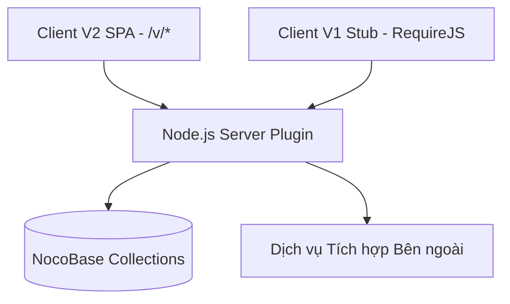
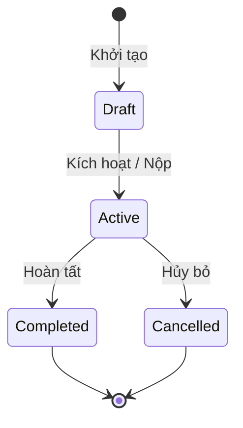
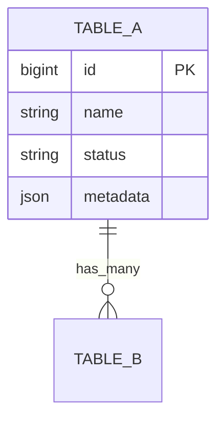

# Mẫu Chuẩn Tài Liệu Đặc Tả Yêu Cầu Sản Phẩm (PRD Template)

> Áp dụng cho các Plugin NocoBase cấp Doanh nghiệp (Enterprise Standards)

```markdown
# TÀI LIỆU YÊU CẦU SẢN PHẨM (PRD)
# [TÊN SẢN PHẨM / TÍNH NĂNG DOANH NGHIỆP]
## Package: `@scope/plugin-name`
## Đơn vị thiết kế & triển khai: [Tên Đơn vị]

---

## MỤC LỤC
1. [TỔNG QUAN & TẦM NHÌN SẢN PHẨM](#1-tổng-quan--tầm-nhìn-sản-phẩm)
2. [KIẾN TRÚC HỆ THỐNG & SƠ ĐỒ THÀNH PHẦN](#2-kiến-trúc-hệ-thống--sơ-đồ-thành-phần)
3. [ĐẶC TẢ CHI TIẾT TỪNG MODULE NGHIỆP VỤ](#3-đặc-tả-chi-tiết-từng-module-nghiệp-vụ)
4. [MÁY TRẠNG THÁI & VÒNG ĐỜI DỮ LIỆU](#4-máy-trạng-thái--vòng-đời-dữ-liệu)
5. [MÔ HÌNH CƠ SỞ DỮ LIỆU (DATABASE SCHEMA & ERD)](#5-mô-hình-cơ-sở-dữ-liệu-database-schema--erd)
6. [DANH MỤC API RESTFUL ĐẦY ĐỦ](#6-danh-mục-api-restful-đầy-đủ)
7. [YÊU CẦU PHI CHỨC NĂNG & TIÊU CHUẨN KỸ THUẬT](#7-yêu-cầu-phi-chức-năng--tiêu-chuẩn-kỹ-thuật)

---

## 1. TỔNG QUAN & TẦM NHÌN SẢN PHẨM
- **Bối cảnh nghiệp vụ**: Nêu rõ vấn đề cốt lõi của doanh nghiệp cần giải quyết.
- **Mục tiêu sản phẩm (SMART Goals)**: Các mục tiêu định lượng và định tính.
- **Đối tượng người dùng (Personas)**:
  - *Người dùng cuối (End-users)*: Nhân viên thao tác nghiệp vụ hàng ngày.
  - *Quản lý (Managers)*: Thẩm định, phê duyệt và giám sát.
  - *Quản trị viên (System Admins)*: Thiết lập cấu hình và phân quyền.

---

## 2. KIẾN TRÚC HỆ THỐNG & SƠ ĐỒ THÀNH PHẦN

- **Dual-Client Compatibility**:
  - Nhánh Client V1: Cung cấp `client.js` định dạng AMD/UMD để RequireJS nạp an toàn trên `/admin/...`.
  - Nhánh Client V2: Cung cấp giao diện hiện đại React 18, Antd v5 dưới tiền tố `/v/`.

---

## 3. ĐẶC TẢ CHI TIẾT TỪNG MODULE NGHIỆP VỤ
*(Mô tả chi tiết từng màn hình, form nhập liệu, logic xác thực, phân quyền 3 cột: Chỉ đọc, Được sửa, Ẩn).*

---

## 4. MÁY TRẠNG THÁI & VÒNG ĐỜI DỮ LIỆU


---

## 5. MÔ HÌNH CƠ SỞ DỮ LIỆU (DATABASE SCHEMA & ERD)


---

## 6. DANH MỤC API RESTFUL ĐẦY ĐỦ
| Endpoint | Method | Quyền hạn ACL | Tham số | Ý nghĩa |
|---|---|---|---|---|
| `/api/resource:action` | `POST` | `loggedIn` | `id`, `values` | Xử lý nghiệp vụ chính |

---

## 7. YÊU CẦU PHI CHỨC NĂNG & TIÊU CHUẨN KỸ THUẬT
- **Thời gian phản hồi**: `< 300ms`.
- **Bảo mật**: Audit trail bất biến cho mọi giao dịch.
- **Chuẩn Tiếng Việt (vi-VN)**: Unicode NFC, dấu kiểu mới, định dạng tiền tệ `1.000.000 ₫`, ngày tháng `dd/MM/yyyy`.
```
